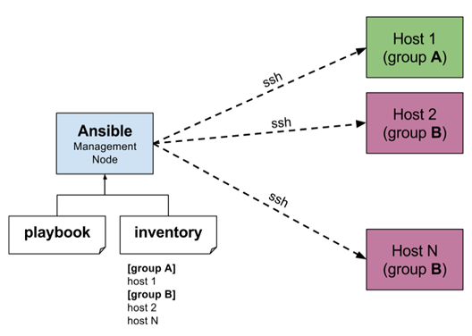
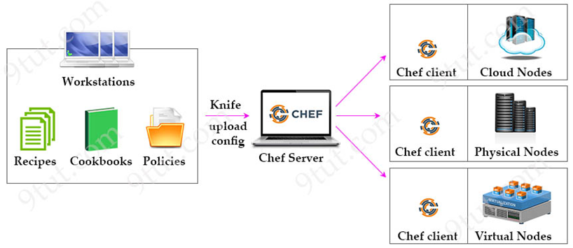
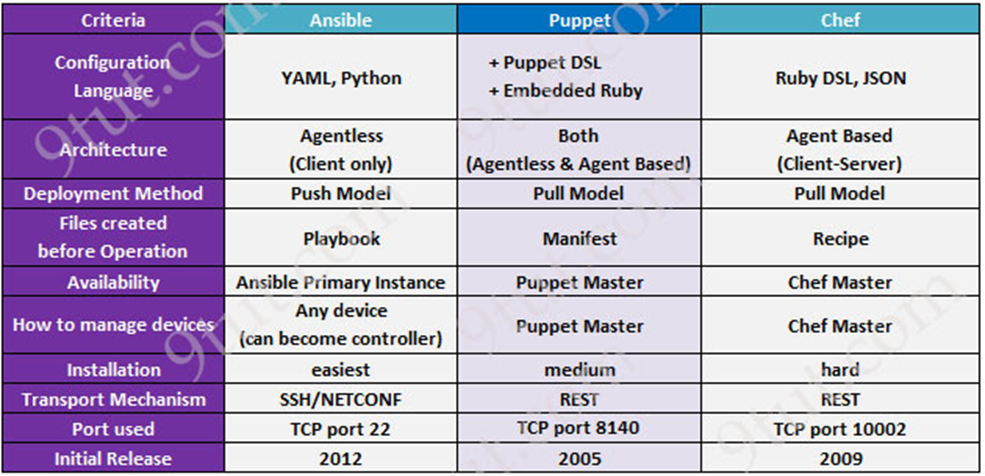

# Ansible

## Table of Contents

1. [System Administrator](#system-administrator-)
2. [Configuration Management](#configuration-management-)
3. [Ansible](#ansible--1)
4. [History](#history)
5. [Ansible Features](#ansible-features-)
6. [Why Ansible](#why-ansible-)
7. [Ansible Uses](#ansible-uses-)
8. [Ansible Work-flow / Ansible Architecture](#ansible-work-flow--ansible-architecture)
9. [Inventory File](#inventory-file)
10. [Chef Work-Flow / Chef Architecture](#chef-work-flow--chef-architecture-)
11. [Difference B/w Ansible, Chef and Puppet](#difference-bw-ansible-cheff-and-puppet-)
12. [Steps to Setup Ansible](#steps-to-setup-ansible-)
13. [Install Ansible In Master/Control Node](#install-ansible-in-mastercontrol-node-)
14. [Establish The Connection B/w Control & Host Node Through SSH](#establish-the-connection-bw-control--host-node-through-ssh-)
15. [YAML (Yet Another Markup Language)](#yaml-yet-another-markup-language-)
16. [Ansible Facts](#ansible-facts)
17. [Ansible Modules](#ansible-modules)
18. [PlayBooks](#playbooks-)
19. [Ansible Playbook Commands](#ansible-playbook-commands-)
20. [Ansible Roles](#ansible-roles)
21. [An Example From an Existing Project](#an-example-from-an-existing-project)

---

* Ansible is a Configuration management tool.

* Ansible is managed by System administrator.

## System Administrator :

In Every Project, we use multiple machines to setup infrastructure for our application.

All these Machines are managed by System Administrator.

The roles and responsibilities of sys administrator is to manage configuration management for machines manually.

## Configuration Management :

* It is method through which we automate the admin tasks like creating user, installing s/w , adding, updating, deleting, data-backup.. anything that is required for our project.

* Configuration management tools turns your code into Infrastructure.

* So, your code would be testable, repeatable and versionable.

* Infrastructure refers to the composite of -
	- Software
	- Network 
	- People 
	- Process

If we have 100's of machines then Manual Configration Management will be difficult.

### Problem with this approach 

* Time consuming

* chance of getting error

* Repeatitive task

* To avoid this Manual Approach, Automation Configuration Management Tools came into Market, those tools are 

    - Ansible (Trending Tool)
    - Chef 
    - Puppet 

Ansible work based on 'Push' Mechanism

Chef & Puppet Tools work based on 'Pull' Mechanism.

Ansible :
========

• Ansible is one of the DevOps Configuration Management tool which is famous for its simplicity.

• Ansible is open-source software developed by Michael DeHaan and Its Owned by RedHat.

• Ansible is an Open-source IT configuration Management, Deployment & Orchestration Tool.

• Ansible is easy to deploy because it doesn’t use any agents or custom security infrastructure. Which means ansible works by connecting nodes through SSH.

• Ansible is automates the Orchestration service – means it follows master and slave concept 

• Ansible uses Playbooks to describes automate the jobs and Playbook uses YAML scripting language which is simple and easy to understand. Which works on Key-Value pair format. (YML/YAML – Yet Another Markup Language)

• Ansible Provides a way to define Infrastructure as code (IAC). Simply means that managing infrastructure by writing code rather than using manual process.

• Ansible is mainly designed for multi-tier deployments.

• Ansible uses the hosts file where one can group the hosts & can control the actions on a specific group in the playbook.

• Ansible GUI [Graphical user interface] is called Ansible-Tower. It was just drag and drop.

• Ansible was written in Python. Dependency of ansible is python.

• Ansible doesn’t require any software to be installed on other machines.

• Ansible’s ability to manage multiple system in parallel and makes well suited for large scale deployment.

• Ansible is widely used in IT industry for managing infrastructure.
 
• Ansible is used for diff tasks such as software installation and file management, service management etc.

• The Main Components of Ansible are Playbooks, Configuration Management and Deployment.

• Ansible uses a playbooks to automate deploy, manage, build, test and configure anything.

## HISTORY:

•	Ansible was first developed in Feb 2012 by Michael Dehaan. 

•	In 2013, Ansible taken over by RedHat.

•	Ansible is available for other OS like Oracle Linux, Debian, CentOS, RHEL.

•	Over the years, Ansible has added many features like security features, support for cloud providers and improved support for windows systems.

•	Now, Ansible is considered one of the leading automation tool in IT industry.

•	Ansible tool is used whether the servers are in On-prem or in the cloud.

•	Ansible turns your code into infrastructure.

## Ansible Features :

* Ansible manages machines in an Agent-less manner SSH.

* Ansible Written in Python and Hence provides a lot of python's functionality. 

* YAML based playbooks. (YML is Human and Machine readable)

* User SSH for secure connections.

* Follows Push based Architecture for sending configurations.

## WHY ANSIBLE :

•	Ansible Automate and Simplify - the repetitive, complex operations and long operations.

•	Ansible is open source, saves time as well as human efforts & is easy to implement.

•	Ansible architecture is easy and effective, it works by connecting to your nodes & pushing small programs to them.

•	Ansible is push based architecture & doesn’t need agents running on the client nodes.

•	Ansible works over SSH. So, nothing needs to install on client machines and it need only a text editor and command line tools are usually enough to get your work done and other tools like chef/puppet need to install agent on the client machines. When we need to perform a task.

•	Ansible is light weight, easy to use and speed deployment compared to other tools.

•	Ansible used when you have multiple server which needs to be configure the same setup in all servers.

•	While doing one to one server their might be a chance to miss some configuration steps in some servers.

•	That’s why we use automation tools 

•	It follows Describe The Desired State Of The System 

## ANSIBLE USES :

1. Agentless Architecture: Ansible doesn’t require any extra software on your remote nodes. Which makes it easy set up and use and It helps to keep the installation clean.

2. Open-source: Ansible one of powerful DevOps tool which is open-source.

3. Simple: Ansible uses the simple syntax written in YML called playbooks. YAML is simple and human readable and doesn’t require any coding skills.

4. Ease of use: One can configure and manages the complex infrastructure solutions very easily. 

5. Powerful & Flexible: Ansible has powerful features that can enable even the most complex IT workflows. 

6. Efficient: No extra software on your server means more resources for your applications.

7. Secure: Ansible uses SSH connection which is secure and encrypted.

8. Configuration Management: used to automate configuration managemet tasks such as provisionig, application deployment and infastructure management.

9. Scalability: Ansible can manage a large number of systems simultaneously, making it ideal for large-scale deployments.

10. Open-source: Free to use and has large community contributors who regularly contribute to its development.

11. Integrate with other tools: Ansible can be integrated with other tools such as Docker, Kubernetes and AWS, which makes it varsatile and easy to use in a variety of environments.

### Push vs Pull Based Architecture

* Puppet and Chef are Pull Based Architecture

	- Agents on the other server periodically checks for the configuration information from central server (Master)

* Ansible is Push Based Architecture

	- Central server pusher configuration information on target servers.

### What Ansible Can do ?

	1) Configuration Management 
	2) App Deployment 
	3) Contineous Delivery 

## Ansible Work-flow / Ansible Architecture 



Ansible uses Master-Slave Architecture.

In Which Machine, Ansible is installed that machine is called as Master Node / Control Node or Ansible Server. 

The Machines, which are managed by Master node they are called as Host Node / Slave node.

Inside Master Node, we are going to write 'Playbooks' to Automate our configuration Management.

Playbooks are written in YAML [Yet Another Markup Language] Language.

Ansible works by connecting to your nodes and pushing out a small program called 'Ansible Module'

Master Node is connected to Host-Node through SSH and execute the small modules on host's machine and install the software.

After Execution, The Modules will be removed on host machines.

The Master node control the entire execution of the playbook. 

The Inventory file provides the list of hosts where ansible modules need to be run.

Ansible requires following three Components to automate the Network Infrastructure, 

	1) Control Node / Master Node 
	2) Managed Nodes / Host Node
	3) Ansible Playbook

1. Control/Master Node :

- The Machine which contains ansible server is called as Control node. It will controll other Host nodes.

2. Managed/Host Node :

- The Nodes which are managed or controlled by ansible is called Host Node /Managed Node

3. Ansible PlayBook :

- Ansible will use Playbook to automate configurations in Host Node.

- Ansible playbooks are expressed in YML format 

- Playbooks are a collection of tasks that will be runs on one or more hosts nodes.

## Inventory File

Ansible Inventory hosts file is used to store the IP_Address of Target servers. we can list and group your host server.

The Default location is "/etc/ansible/hosts"

Note: In Inventory file, we can mention Private_IP Address or Hostname also.


### Few Important Point about Inventory File 

1. Comments begins with '#' character.

2. Blanklines are ignore

3. Group of hosts are delimited by '[header]' elements.

4. You can enter hostname or Ip addresses.

5. A hostname/ip can be a member of multiple groups.

6. Ungrouped hosts are specifying before any group header like below

### Sample Inventory File :

```
#Blank lines are ignore

#Ungrouped hosts are specifying before any group header like below 

192.168.122.1    #Private_IP
192.168.122.2
192.168.122.3

[webservers]

192.168.122.1
#192.168.122.2
192.168.122.3

[dbserver]

192.168.122.1
192.168.122.2 	
silver-db1  	#hostname
silver-db2  	
```

## Chef Work-Flow / Chef Architecture :



* Work stations - we write cookbooks[ruby] after shared to chef master.

* Chef server - we install chef and connected to chef client servers.

* Chef client - we have different Nodes

* If we Compare Ansible and chef - Ansible is easy to setup and run in any environment [any device]

## Difference B/w Ansible, Cheff and puppet :




## ``STEPS TO SETUP ANSIBLE`` 

* Create 2 RedHat Systems In AWS with .pem  (Free-ties Eligible)
    - Master Node 
    - Slave Node
* Connect to the Nodes and create Ansible_User and Passwd

* Create User 
```
sudo useradd ansible
```
* Create Password 
```
sudo passwd ansible 
```
* Configure Ansible_User in Sudo file (All Permissions like Root)
```
sudo visudo 
```
Add the following configuration in 100th line
    >> ```ansible ALL=(ALL) NOPASSWD: ALL```   

* Configure SSH : Ansible uses SSH to connect to remote machines.
```
sudo vi /etc/ssh/sshd_config
```
Change the following configurations in below 60 line

    >> Comment  ``` #PasswordAuthentication no ```
    
    >> Un-Comment  ``` PasswordAuthentication yes ```

* Now, Restart SSH Service
```
sudo systemctl restart sshd 
```
Or We can use alternate command: ``sudo service sshd restart``

Note: Do all above steps in Master and Slave Nodes

## `` Install Ansible In Master/Control Node ``

1. Install Ansible in Master Node
```
sudo amazon-linux-extras install ansible2 -y
```
* To Varify Ansible Version, Run the following command
``` 
ansible --version 
```
2. Install Ansible Dependencies
```
sudo yum install python python-pip python-level openssl -y
```
* To varify Python 
```
python --version
```
That's it! You have successfully set up an Ansible server on Linux with the necessary dependencies. You can now use Ansible to automate the configuration and management of your IT infrastructure.

* Ansible Default location : ``cd /etc/ansible``
    * Ansible folder staructure 
        * ansible.cfg 
        * hosts
        * roles

## ``Establish The Connection B/w Control & Host Node Through SSH ``

1. Switch to Ansible user in Control Node
```
    sudo su - ansible
```
2. Generate SSH key in Ansible Server
```
    ssh-keygen
```
Click on 'Enter' 3 Times and You will get the SSH key. The Generated SSH key stored in '/home/ansible/.ssh/id_rsa'

3. Add the Control node's SSH key (Copy Keygen to Host Server as Ansible user):
```
    ssh-copy-id <user>@<slave_node_ip_address>
```
Replace "user" with the username you use to log in to the slave node and "slave_node_private_ip" with the IP address of the slave node.
i.e, ``` ssh-copy-id ansible@172.31.41.168 ``` and Slave Node User Passwd: ``123``

Note : We can configure no. of slave nodes using above command.

* We can login into slave node from control node using following command 
```
    ssh ansible@172.31.41.168
```
If you want to logout from slave node, run `` exit `` command 

4. Configure Host Server Details in Host Inventory file  
```
    vi /etc/ansible/hosts
```
In the inventory file, The Host details as Grouped and Ungrouped Hosts

    #Ungrouped Host can configured as 
    172.31.41.168  or Host_Name

    #Grouped Host Can be configured as 
    [webserver]
    172.31.41.168  or Host_Name
    172.31.41.169  or Host_Name

These Hosts are not execute directly. if u want to execute these groups by giving permissions.

5. Give Permission to Inventory file and sudo_user [FROM ROOT USER]
```
    vi /etc/ansible/ansible.cfg
```
Giving permissions to Inventory and Root by removing '#'

    inventory      = vi /etc/ansible/hosts   
    sudo_user      = root

6. Using Ping module, we can varify the connection b/w Control and Host Node
```
    ansible all -m ping
```
* To get the list of all hosts connected to control node
```
    ansible all --list-hosts
``` 
* To get the particular group hosts connected to control node
```
    ansible <groupName> --list-hosts

    Example : ansible webserver --list-hosts
```
* To get the particular group index value connected to control node 
```
    ansible <groupName>[IndexValue] --list-hosts

    Example : ansible all[0] --list-hosts 
```

## YAML (Yet Another Markup Language) :

* YAML is human friendly data serialization language for all programming languages.

* YAML files are both human readable and machine readable

* YML files will have .yml as an extension

* In YML, the data will represent in Key-Value Pair.
	
* Indent space very important in YML language. 

* Official website : https://yaml.org/


### Key-Value Pair Format :
```
---
name: silver 
email: silver@gmail.com
gender: male

...
```

### Arrays / list Format :
```
---
name: 				     #element 
    firstname: naveen    #sub-element 
    lastname: silver
email: silver@gmail.com
gender: male
skills:
    - python       #list of items
    - linux
    - devops 
    - aws 
```
Here, - dash indicate the element of any array.

we can use VS code IDE to write and validate YML files.

## Ansible Facts

* **Facts** are information that Ansible **collects automatically** about every managed host, BEFORE running any task in the playbook.

* Examples of collected information: the machine's OS, its version, its CPU architecture (x86_64, arm64...), its network interfaces, its total RAM, its disks, its hostname, etc.

* Ansible collects these facts via a special module called `setup`, which is executed automatically at the beginning of each playbook (unless disabled).

### Why Facts Are Important

Without facts, you would need to **hardcode** different values depending on the target OS (Ubuntu vs Debian vs CentOS), the architecture (x86_64 vs arm64), etc. With facts, the playbook becomes **dynamic and portable**: a single playbook works on any machine.

This is the principle used later in the real-world `docker` role example:
```yaml
url: "https://download.docker.com/linux/{{ ansible_facts['distribution'] | lower }}/gpg"
```
Here, Ansible automatically detects whether the machine is "Ubuntu" or "Debian", and adapts the URL accordingly — without any hardcoded values.

### Viewing a Machine's Facts

```
ansible <host> -m setup
```

This command returns a LARGE JSON block containing hundreds of variables. To filter and display only what we're interested in:
```
ansible <host> -m setup -a "filter=ansible_distribution*"
```

### Most Commonly Used Facts in Practice

| Fact | Example Value | Typical Usage |
|---|---|---|
| `ansible_facts['distribution']` | `Ubuntu` | choose the correct repo/package |
| `ansible_facts['distribution_release']` | `jammy`, `bookworm` | build the apt repo URL |
| `ansible_facts['distribution_version']` | `22.04` | `when` conditions based on the OS version |
| `ansible_facts['architecture']` | `x86_64`, `aarch64` | choose the correct binary to download |
| `ansible_facts['os_family']` | `Debian`, `RedHat` | choose `apt` vs `yum` in a generic task |
| `ansible_facts['hostname']` | `web01` | display, logs, templates |
| `ansible_facts['default_ipv4']['address']` | `192.168.56.10` | dynamic network configuration |
| `ansible_facts['memtotal_mb']` | `2048` | size parameters based on RAM |
| `ansible_user` | `ansible` | not a "fact" in the strict sense but a widely used magic variable — the current SSH user |

Note: `ansible_facts['distribution']` is the modern (recommended) syntax. The old syntax `ansible_distribution` (without the dictionary) still works but is deprecated.

### Example: Making a Task Multi-OS Using Facts

```yaml
- name: Install on Debian/Ubuntu
  ansible.builtin.apt:
    name: docker-ce
    state: present
  when: ansible_facts['os_family'] == "Debian"

- name: Install on RedHat/CentOS
  ansible.builtin.yum:
    name: docker-ce
    state: present
  when: ansible_facts['os_family'] == "RedHat"
```

### Custom Facts (`set_fact`)

You can also define your own "facts" during a playbook run using the `set_fact` module, which is useful for storing an intermediate result and reusing it later:
```yaml
- name: Calculate a value and store it
  ansible.builtin.set_fact:
    my_custom_port: "{{ 8080 if env == 'prod' else 8081 }}"
```

### Disabling Fact Collection (Performance)

If a playbook doesn't need any facts (rare), you can disable fact collection to save execution time:
```yaml
- hosts: all
  gather_facts: false
```

## Ansible Modules

* A **module** is a unit of code that Ansible **sends and executes** on the target host to accomplish ONE specific action: install a package, copy a file, manage a service, create a user, etc.

* Each line under `tasks:` in a playbook corresponds to a module call with its parameters.

* As mentioned above: after execution, the module is removed from the managed host (no residue is left on the target machine).

### Anatomy of a Module Call

```yaml
- name: Install Docker
  ansible.builtin.apt:        # <- the module
    name: docker-ce           # <- parameter 1
    state: present            # <- parameter 2
    update_cache: true        # <- parameter 3
```

* `ansible.builtin.apt` is the FQCN (Fully Qualified Collection Name), in the format `<namespace>.<collection>.<module>`. This is the recommended syntax in modern Ansible (as we'll see in the real-world example below), instead of simply `apt`.

* Each module has its own list of parameters, documented officially.

### Essential Module Categories

**Package Management**
```yaml
ansible.builtin.apt:      # Debian/Ubuntu
  name: nginx
  state: present           # present | absent | latest

ansible.builtin.yum:      # RedHat/CentOS
  name: nginx
  state: present

ansible.builtin.package:  # generic, automatically detects the package manager
  name: nginx
  state: present
```

**Service Management**
```yaml
ansible.builtin.service:   # generic (systemd, sysvinit...)
  name: nginx
  state: started            # started | stopped | restarted | reloaded
  enabled: true              # automatic start at boot

ansible.builtin.systemd:   # specific to systemd, more control
  name: docker
  state: restarted
  enabled: true
  daemon_reload: true
```

**Copy / Files / Templates**
```yaml
ansible.builtin.copy:      # copy a static file (or inline content)
  src: local_file.conf
  dest: /etc/app/file.conf
  mode: "0644"

ansible.builtin.template:  # copy a Jinja2 file (.j2), with variables substituted
  src: nginx.conf.j2
  dest: /etc/nginx/nginx.conf
  notify: restart nginx

ansible.builtin.file:      # create/delete directories, empty files, symbolic links, permissions
  path: /opt/myapp
  state: directory          # directory | file | absent | link | touch
  mode: "0755"
  owner: ansible
  group: ansible

ansible.builtin.lineinfile:  # add/modify ONE line in an existing file without rewriting it entirely
  path: /etc/hosts
  line: "192.168.56.10 web01"
  state: present

ansible.builtin.get_url:   # download a file from a URL
  url: "https://example.com/file"
  dest: /usr/local/bin/file
  mode: "0755"
```

**User and Group Management**
```yaml
ansible.builtin.user:
  name: ansible
  groups: docker
  append: true               # IMPORTANT: without this, it overwrites the user's other groups
  state: present
  shell: /bin/bash

ansible.builtin.group:
  name: developers
  state: present
```

**Running Arbitrary Commands**
```yaml
ansible.builtin.command:   # runs a command, NOT through a shell (no pipes, no &&, no shell variables)
  cmd: "systemctl status docker"

ansible.builtin.shell:     # like command, but runs through a real shell (pipes, &&, redirections OK)
  cmd: "docker ps | grep nginx"

ansible.builtin.raw:       # runs a raw command WITHOUT going through Python on the host
                             # useful only when Python is not yet installed on the target
```
⚠️ Important rule: always prefer a dedicated module (`apt`, `service`, `copy`...) over `command`/`shell` when one exists, because dedicated modules are **idempotent** (they check the current state before acting), whereas `command`/`shell` run on every execution, whether necessary or not.

**Docker-Specific Modules** (heavily used in a DevOps context)
```yaml
community.docker.docker_container:  # create/manage a container
  name: jenkins
  image: jenkins/jenkins:lts
  state: started
  ports:
    - "8080:8080"

community.docker.docker_image:      # manage an image (pull, build)
  name: myapp
  source: pull
```
Note: these Docker modules are NOT part of `ansible.builtin` — they come from the `community.docker` collection, which must be installed separately with `ansible-galaxy collection install community.docker`. This is the reason why the `docker` role in the real-world example (Task 6 below) installs the Python SDK `docker`: these `docker_*` modules need it to function on the target host.

**Network/Repo Modules** (used in the real-world example below)
```yaml
ansible.builtin.apt_key:        # add a GPG key
ansible.builtin.apt_repository: # add an apt repository
```

**Flow Control Modules** (not "actions" per se, but essential)
```yaml
ansible.builtin.debug:      # display a variable/message during execution (debugging)
  var: ansible_facts['distribution']

ansible.builtin.wait_for:   # wait for a port/file/condition to become available (e.g., wait for Jenkins to be up before continuing)
  port: 8080
  delay: 5
  timeout: 60

ansible.builtin.fail:       # stop the playbook with an error message if a condition is true
  msg: "Required variable missing"
  when: my_var is not defined
```

### How to Find a Module's Documentation

```
ansible-doc ansible.builtin.apt
```
This displays directly in the terminal all the possible parameters of the module, with examples. This should be your reflex whenever you discover a new module — more reliable than searching the internet, because it reflects exactly the version of Ansible installed locally.

### Summary — Modules vs Facts

| | Facts | Modules |
|---|---|---|
| Role | Read the state / information of the machine | Act on the machine |
| When | Collected automatically at the beginning of the play | Called on each task |
| Example | `ansible_facts['distribution']` | `ansible.builtin.apt` |
| Analogy | The "sensors" | The "actuators" |

Together, Facts + Modules are what makes a playbook **dynamic** (adapts to the target via facts) and **idempotent** (acts intelligently via dedicated modules rather than raw commands).

## PlayBooks :

* Playbooks in ansible written in YAML language.

* Playbooks is a single yaml files, containing one or more 'plays' in a list.

* Plays are ordered sets of tasks to execute against host servers from inventory file.

* Playbook code consists of vars, tasks, handlers, file, template and roles.

* Each playbook is composed of one or more modules in a list.

* Module is a collection of configuration files

* Play defines a set of tasks to be run on hosts.

* Task is an action to be performed on host.
 
* Example: 
	- Execute a command
	- Run a shell script
	- Install Package 
	- Shutdown/Restart hosts.

* Playbooks starts with '---' and ends with '...'

### Playbook contains 3 sections :

    1) Host Section : Defines the target machines on which the playbook should run. This is based on the Ansible Inventory file.

    2) Variable Section: This is optional and can declare all the variables needed in the playbook.

    3) Task Section: This section list out all tasks that should be executed on the target machine. it specifies the use of modules. Every tasks has a name which is small description of what the task will do and will be listed while the playbook is run.

### Types of state In Playbook :

    1. present - add/install
    2. absent - remove/uninstall
    3. latest - latest  
    4. restarted - restart

## Playbook Examples :

Q) Write a playbook to ping all host nodes ?
```
---                  #indicates yaml file 
- hosts: all           # - indicates list
  user: ansible         # user name 
  become: true         #it allows you to execute playboks as root user
  connection: ssh 

  tasks:		# here provide the list of tasks 
    - name: Ping All Host Nodes
      ping:
      remote_user: ansible
...
```

#Hosts - The Tasks will be executed in specified group of server.

#Name - Which is the task name that will appear in your terminal when you run the playbook.

#Remote_user - This parameter was formerly called just user.


## Ansible Playbook Commands :

* To Varify the Syntax of Playbook
```
ansible-playbook <playbookName> --syntax-check
```
* Syntax to Execute a Playbook
```
ansible-playbook <PlaybookName>
```
* Syntax to Execute a Playbook in verbose mode
```
ansible-playbook <PlaybookName> -v	#Details of execution 
ansible-playbook <PlaybookName> -vv	#To get more details of execution
ansible-playbook <PlaybookName> -vvv	#To get complete execution details  # -v verbosity means debug
```
* Playbook Dry-Run Command 
```
ansible-playbook <PlaybookName> --check
```
* List of Hosts in Playbook
```
ansible-playbook <PlaybookName> --list-hosts
```
* It will Execute one-step-at-a-time, confirm each task before running (N)o/(y)es/(c)ontinue
```
ansible-playbook <playbookName> --step
```
* It will Help on Ansible-playbook Command
```
ansible-playbook help
```

## Ansible Roles

* Roles are a way of organizing playbooks into re-usable, self-contained units of automation.

* When your playbook grows too big (lot of tasks, lot of variables, lot of files, templates, handlers) it becomes messy and hard to maintain. Roles solve this problem by breaking one huge playbook into small, structured, re-usable components.

* Best ex, Lets say i want to configure a kubernetes cluster using ansible. so, it will have close to some 50 to 60 tasks and we have lot of variables and lots of parameters, you have certificates, you have secrets that you have to configure while creating the kubernetes cluster. So instead of writing all this in one single playbook, we segregate everything using Roles and we can properly structure our ansible playbooks. That's why the concept of roles is introduced.

* In short - **A Role = Tasks + Variables + Files + Templates + Handlers**, all packaged together around ONE single responsibility.

### Why Ansible Roles

* Re-usability - Once you write a role (Example: `docker` role, `nginx` role) you can reuse the same role in any project, any playbook, just by calling its name.

* Better Organization - Instead of one long playbook, each role handles only its own job. Example: `docker` role only installs docker, `jenkins` role only configures jenkins.

* Easy to maintain - If something is wrong in Docker installation, you go directly to `docker` role, you don't need to search in the whole playbook.

* Sharing - Roles can be shared with other people/teams, or even downloaded from Ansible Galaxy (community roles).

* Scalability - When Infrastructure grows (more servers, more services) roles make it easy to scale your automation without repeating code.

### Role Directory Structure

When you create a role, Ansible expects a **standard folder structure**. You don't need to mention paths manually, Ansible automatically picks files based on folder names.

```
mkdir folder
cd folder
ansible-galaxy role init kubernetes
```

Output: `Role kubernetes was created successfully.`

If you run `ls`, You will see a folder called `kubernetes` created.

If you run `ls kubernetes`, you can see a bunch of files/folders auto created. This is the concept of Roles.

Using these files and folders, we structure our ansible playbooks.

### Files and Folders inside a Role

```
tasks/       -> main list of tasks that role will execute (heart of the role)

handlers/    -> handlers which get triggered using 'notify' (Example: restart service)

templates/   -> Jinja2 (.j2) files which get templated to target machine

files/       -> static files which get copied as-is to target machine (no templating)

vars/        -> variables with HIGH priority (hard-coded values, rarely changed)

defaults/    -> variables with LOW priority (default values, easily overridden)

meta/        -> metadata about role - author, license, description, role dependencies

tests/       -> used to add some unit tests for the role

README.md    -> documentation on how to use this role
```

* Note : You don't have to create/use all folders. Only create the folders that you actually need for that role. Most simple roles will only use `tasks/main.yml`.

### How a Role gets called inside a Playbook

Instead of writing tasks directly inside playbook, we call the role name.

Q) Write a playbook to call a role named `docker` on webserver group ?
```
---
- hosts: webserver
  become: true
  roles:
    - docker
...
```

* Here, Ansible automatically goes and searches for `roles/docker/tasks/main.yml` and runs it. This is because of the Standard directory structure we saw above.

* You can also call multiple roles in one playbook, they execute in the order you list them.

Q) Write a playbook to call multiple roles - common, docker, jenkins ?
```
---
- hosts: jenkins_server
  become: true
  roles:
    - common
    - docker
    - jenkins
...
```

* Here, first `common` role tasks will run, then `docker` role tasks, then `jenkins` role tasks - one after another, in the given order.

### Example - Writing tasks inside a Role

Q) Write tasks inside `docker` role to install docker on Ubuntu machine ?

File : `roles/docker/tasks/main.yml`
```
---
- name: Install prerequisite packages
  apt:
    name: ["ca-certificates", "curl", "gnupg"]
    state: present
    update_cache: true

- name: Add Docker repository
  apt_repository:
    repo: "deb https://download.docker.com/linux/ubuntu {{ ansible_distribution_release }} stable"
    state: present

- name: Install Docker Engine
  apt:
    name: ["docker-ce", "docker-ce-cli", "containerd.io"]
    state: present
  notify: restart docker
...
```

File : `roles/docker/handlers/main.yml`
```
---
- name: restart docker
  systemd:
    name: docker
    state: restarted
...
```

* Here, `notify: restart docker` will trigger the handler ONLY IF the task "Install Docker Engine" actually makes a change on the machine. This is what makes Ansible **idempotent**.

### Role Dependencies (meta folder)

* Sometimes one role needs another role to run first. Example: `jenkins` role needs `docker` role to be installed first.

* Instead of manually calling both roles every time in playbook, we define this dependency inside `meta/main.yml` of the jenkins role.

File : `roles/jenkins/meta/main.yml`
```
---
dependencies:
  - role: docker
...
```

* Now, if you just call `roles: [jenkins]` in your playbook, Ansible will automatically run `docker` role first, then `jenkins` role. You don't need to call docker separately.

### Variables in Roles - defaults vs vars

* `defaults/main.yml` -> LOW priority variables. Meant to be overridden easily by the user of the role. Example: version numbers, ports.

* `vars/main.yml` -> HIGH priority variables. Meant to be fixed values that should not normally change. Example: package names, fixed paths.

Q) Write default variables for docker role ?

File : `roles/docker/defaults/main.yml`
```
---
docker_users: []
docker_compose_version: "2.24.0"
...
```

* Rule of thumb - if it's something the user of the role might want to change -> put it in `defaults/`. If it's something internal to how the role works -> put it in `vars/`.

### Summary Table

| Concept | Explanation |
|---|---|
| Role | Re-usable unit of automation with a single responsibility |
| `ansible-galaxy role init <name>` | Command to auto-generate role folder structure |
| `tasks/main.yml` | Entry point, list of tasks the role runs |
| `handlers/main.yml` | Actions triggered by `notify`, only run on change |
| `defaults/main.yml` | Low priority, easily overridden variables |
| `vars/main.yml` | High priority, fixed variables |
| `meta/main.yml` | Role info + role dependencies |
| `roles:` in playbook | How you call one or many roles on a group of hosts |

## An Example From an Existing Project

* Till now we saw the theory + a simple example. Now let's take a REAL `docker` role taken from an actual project and break it down file by file, task by task. This will help you connect theory with real world usage.

* This role's job : Install Docker Engine + Docker Compose + Python Docker SDK on a machine, optionally configure it to talk to a private insecure registry, and make sure a non-root user can use docker.

### File : `defaults/main.yml`

```
---
docker_compose_version: "latest"
```

* Here, `docker_compose_version` is a LOW priority variable (remember - `defaults/` = easily overridden). By default it's set to `"latest"`, but Playbook or Inventory can override this value to pin a specific version, Example: `docker_compose_version: "v2.24.0"`.

* This is exactly the "Rule of thumb" we saw before - version numbers are something the USER of this role might want to change, so it belongs in `defaults/`, not `vars/`.

### File : `handlers/main.yml`

```
---
- name: restart docker
  ansible.builtin.service:
    name: docker
    state: restarted
    enabled: true
```

* Same concept as before, this handler will restart the `docker` service, but ONLY when it gets called using `notify`.

* Note : Here they used `ansible.builtin.service` module (Fully Qualified Collection Name - FQCN), instead of just `service`. In newer Ansible versions, its recommended to use FQCN (`ansible.builtin.xxx`) to avoid confusion with community modules of the same name.

### File : `tasks/main.yml` - breaking it down task by task

* At the top, you will see comments starting with `#`. This is a good practice, always document WHAT the role does and WHY, especially for tricky parts (like the insecure registry task below).

```
# Role: docker
# Installs Docker Engine + Compose plugin + Python SDK (for docker_* modules
# and the docker compose play in other roles).
```

**Task 1 - Add Docker's GPG key**
```
- name: Ensure Docker GPG key is present
  ansible.builtin.apt_key:
    url: "https://download.docker.com/linux/{{ ansible_facts['distribution'] | lower }}/gpg"
    state: present
```
* `ansible_facts['distribution']` is an Ansible FACT (auto-detected info about the target machine, Example: Ubuntu, Debian). `| lower` is a Jinja2 FILTER that converts it to lowercase, because Docker's URL needs it in lowercase (`ubuntu`, not `Ubuntu`).
* This makes the task DYNAMIC - same task works whether the machine is Ubuntu or Debian, no hardcoding needed.

**Task 2 - Add the Docker apt repository**
```
- name: Add Docker apt repository
  ansible.builtin.apt_repository:
    repo: "deb [arch={{ ansible_facts['architecture'] }}] https://download.docker.com/linux/{{ ansible_facts['distribution'] | lower }} {{ ansible_facts['distribution_release'] }} stable"
    state: present
    update_cache: true
```
* Three facts used here - `architecture` (Example: x86_64), `distribution` (lowercased), `distribution_release` (Example: jammy, bookworm). Again, fully dynamic, no hardcoded OS name/version.

**Task 3 - Install Docker Engine and CLI**
```
- name: Install Docker Engine and CLI
  ansible.builtin.apt:
    name:
      - docker-ce
      - docker-ce-cli
      - containerd.io
      - docker-buildx-plugin
      - docker-compose-plugin
    state: present
```
* Standard package installation, same concept we already saw, just with a bigger package list (this time using `apt` module directly with a list of packages).

**Task 4 & 5 - Install docker-compose binary (pinned vs latest)**
```
- name: Install docker compose binary (pinned version)
  ansible.builtin.get_url:
    url: "https://github.com/docker/compose/releases/download/{{ docker_compose_version }}/docker-compose-linux-{{ ansible_facts['architecture'] }}"
    dest: /usr/local/bin/docker-compose
    mode: "0755"
  when: ansible_facts['architecture'] == "x86_64" and docker_compose_version != "latest"

- name: Install docker compose binary (latest)
  ansible.builtin.get_url:
    url: "https://github.com/docker/compose/releases/latest/download/docker-compose-linux-{{ ansible_facts['architecture'] }}"
    dest: /usr/local/bin/docker-compose
    mode: "0755"
  when: ansible_facts['architecture'] == "x86_64" and docker_compose_version == "latest"
```
* This is where `defaults/main.yml`'s `docker_compose_version` variable gets USED. Notice the two tasks are mutually exclusive using `when:` (conditional execution) :
    - Task 4 runs ONLY IF the user pinned a specific version (`!= "latest"`)
    - Task 5 runs ONLY IF the user left it as `"latest"` (default)
* `get_url` module downloads a file from internet straight to the target machine, `mode: "0755"` makes it executable (rwxr-xr-x).
* This shows how ONE variable (`docker_compose_version`) can control the behaviour/flow of multiple tasks. That's the whole point of putting it in `defaults/` instead of hardcoding it.

**Task 6 - Install Python Docker SDK**
```
- name: Install Python Docker SDK (for docker_* modules)
  ansible.builtin.pip:
    name:
      - docker
      - docker-compose
    state: present
```
* Some Ansible modules like `docker_container`, `docker_image` (the `docker_*` modules mentioned in the comment) need the Python `docker` library installed on the TARGET machine to work. This task installs it via `pip` module.

**Task 7 - Configure insecure registry**
```
# If you run a private registry over plain HTTP (no TLS), the docker
# daemon on every host must explicitly allow it as insecure —
# otherwise docker login/push/pull will be rejected.
- name: Configure docker daemon for the insecure registry
  ansible.builtin.copy:
    dest: /etc/docker/daemon.json
    content: |
      {
        "insecure-registries": ["{{ registry_host }}:{{ registry_port }}"]
      }
  notify: restart docker
```
* This is the most important task to understand, and this is exactly WHY comments matter - without that comment, you wouldn't know why this task even exists.
* `ansible.builtin.copy` with `content:` (instead of `src:`) lets you write file content DIRECTLY inside the task, no need for a separate template file.
* `registry_host` and `registry_port` are variables coming from OUTSIDE this role (for example from your inventory, `group_vars/`, or a playbook's `vars:` section, since they're not defined in this role's `defaults/` or `vars/`). This is normal - a role can use variables defined anywhere in your Ansible project, not only its own `defaults/`/`vars/`.
* `notify: restart docker` - This is the link back to `handlers/main.yml`. If this file's content CHANGES (Ansible's `copy` module is idempotent, it only reports "changed" if the content is actually different from what's already there), then and ONLY then the `restart docker` handler gets triggered at the end of the play.

**Task 8 - Add user to docker group**
```
- name: Ensure current user can use docker
  ansible.builtin.user:
    name: "{{ ansible_user }}"
    groups: docker
    append: true
```
* `ansible_user` is another Ansible fact/variable - the SSH user Ansible is connecting with. `append: true` is CRITICAL here - without it, `groups: docker` would REMOVE the user from all its other groups and put it ONLY in `docker` group. `append: true` means "ADD to docker group, keep existing groups too".

**Task 9 - Start and enable docker**
```
- name: Start and enable docker
  ansible.builtin.service:
    name: docker
    state: started
    enabled: true
```
* `state: started` makes sure docker is running NOW. `enabled: true` makes sure docker starts automatically on every future boot. Note the difference with the handler - the handler does `state: restarted` (used when config CHANGED and needs a restart), this task does `state: started` (used at first install/every run, just to make sure it's up).

### What This Example Teaches You

| Concept from theory | Where it's used in this real role |
|---|---|
| `defaults/main.yml` = overridable variable | `docker_compose_version` |
| `notify` + handler | Task 7 (`daemon.json` change) triggers `restart docker` handler |
| Ansible Facts | `ansible_facts['distribution']`, `['architecture']`, `['distribution_release']` |
| Jinja2 Filters | `| lower` |
| `when:` conditional | Tasks 4 & 5, mutually exclusive on `docker_compose_version` |
| Variables from outside the role | `registry_host`, `registry_port`, `ansible_user` |
| Idempotence | `copy` module only reports change (and notifies) if content actually differs |
| Comments as documentation | Explaining WHY the insecure registry task exists |